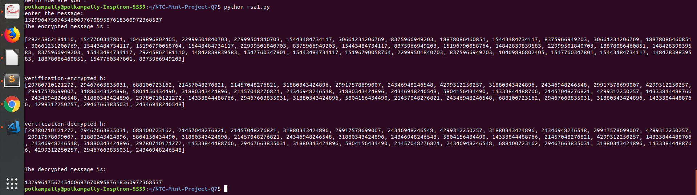

**Problem Statement**

Analysis and design of enhanced RSA algorithm to improve the security 
 
Link for the Paper : [here](https://ieeexplore.ieee.org/document/7977330/)

**Members :**

1. Polkampally Keerthana        16CO131  keerthana.keetu.p@gmail.com  
2. Archana Priyadarshani Sahoo  16CO207  archana98priya@gmail.com

**File Structure**  
**main.py**             :implementation of the Enhanced RSA algorithm in python. 
**primes-to-100k.txt**  :text file containing list of prime numbers from 2 to 100000. 
**private_keys.txt**    :contains the private key on running main.py. 
**public_keys.txt**     :contains the public key on running main.py. 
**screenshot**          :Screenshots of the resuslt. 

**Language used for implementation**: Python  

**Summary:** 
     
    Modified approach is an enhancement over traditional RSA algorithm that includes exponential powers, n prime numbers, multiple public keys, and K-NN algorithm.
    This approach also gives feature of verification at both side’s sender and receiver which ensures authenticity of a message. 
    It proposes an algorithm which uses four prime numbers in place of two prime numbers thereby increasing the time needed to find these primes.The calculation of public key and private key depends on the value of N, which is the product of prime numbers. 
     
**Functions used in implementation:** 
  1. gcd- Euclidean 
     2. xgcd- Extented Euclidean 
     3. chooseE- Used for encryption 
     4. knnalgo-KNN algorithm 
     5. chooseKeys- Key Generation 
     6. iterative- Fast Exponentiation 
     7. verify_encrypt- Verification purpose 
     8. encrypt - Encryption 
     9. decrypt - Decryption 
      
**Advantages:** 
 Modified approach introduces an additional level of security using k-nearest neighbor algorithm. It enhances the randomness of the calculated value in cipher text. As it removes the problem of redundancy in cipher text same as plain text. In modified approach there is no repetition of cipher text same as plain text. By adopting this any intruder finds it difficult to hack the information being transmitted. It is helpful in increasing the efficiency and security of the approach. Modified approach uses two public keys which are sent separately, this makes the attacker not to get much knowledge about the keys and unable to decrypt the message. 
 Modified approach has verification at both ends sender and receiver which ensures authenticity of a message. It initially converts message string in to respective ASCII values as this conversion also increases complexity   
 
**limitations:** 
     
    The encryption and decryption time of proposed approach is higher than original RSA.
     
     
**Results:** 
     
     The code works successfully . It encrypts the plaintext given by the user into a ciphertext and decrypts it back to give the original text according to the algortihm mentioned in the paper. 
     
**Screenshot of the output**: 

  
    